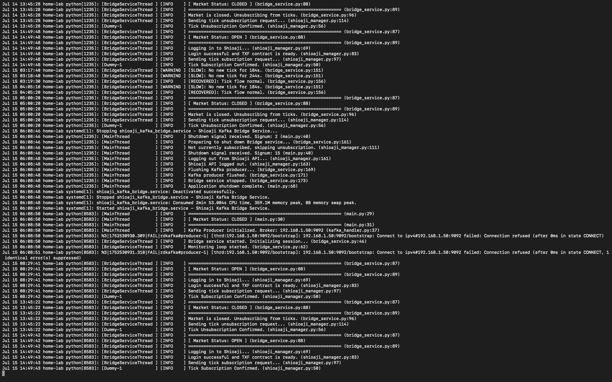

# Shioaji Kafka Bridge

 
 
 


Production-ready service streaming real-time Taiwan Futures Exchange (TAIFEX) tick data via Shioaji API to Apache Kafka, built for high availability and modularity.

> Ideal for trading systems or data pipelines needing high-frequency TAIFEX futures data via Shioaji and Kafka.


---

## Features

- **📈 Real-time Tick Streaming**  
  Streams high-frequency TXF tick data from the Shioaji API to Kafka with minimal latency.

- **🧩 Modular Design**  
  Separates config, connection, and logic for easy maintenance and scalability.

- **🔄 Auto-Reconnect**  
  Automatically recovers from network or session failures for uninterrupted operation.

- **🗓️ Market Holiday Detection**  
  Distinguishes between genuine disconnections and market closure to avoid false alerts.

- **⚡️ Kafka Optimization**  
  Uses batching (`batch.size`, `linger.ms`) and compression (`compression.type`) for performance.

- **📝 Transparent Logging**  
  Emits structured, human-readable logs covering market transitions and errors.

- **🔑 `.env`-Driven Configuration**  
  Securely manages credentials and settings through environment variables.

---

## System Architecture

This project acts as a "bridge" in the system, with the following data flow:

```
+----------------+      +------------------------+      +------------------------+
|  Shioaji API   | <--> |  Shioaji Kafka Bridge  | ---> |      Apache Kafka      |
| (Quote Source) |      |     (This Service)     |      |  (Streaming Platform)  |
+----------------+      +------------------------+      +------------------------+
```

---


## Prerequisites

Before you begin, ensure you have the following ready:

1.  **Python**: Version 3.9 or higher.
2.  **Apache Kafka**: A running Kafka cluster.
3.  **Shioaji Account**: A valid set of API Key and Secret Key for SinoPac Futures Shioaji.

---

## Installation and Setup

Follow these steps to set up your development environment:

1.  **Clone the repository**:
    ```bash
    git clone https://github.com/gman-quant/shioaji-kafka-project.git
    cd shioaji-kafka-project
    ```

2.  **Create and activate a Python virtual environment**:
    ```bash
    # Create the virtual environment
    python -m venv venv
    ```
    ```bash
    # Activate on macOS/Linux
    source venv/bin/activate
    ```
    ```bash
    # Activate on Windows (Git Bash)
    source venv/Scripts/activate
    ```

3.  **Install dependencies**:
    ```bash
    pip install -r requirements.txt
    ```

4.  **Set up environment variables**:  
    This project uses a `.env` file to manage sensitive credentials and runtime settings.  
    An example environment file is provided as `.env.example`.

    To get started, copy or rename it as `.env`:

    ```bash
    cp .env.example .env
    ```

    Then, open `.env` and replace the placeholder values with your actual credentials and settings:

    ```ini
    # .env

    # --- Shioaji API Credentials ---
    SHIOAJI_API_KEY="your_real_api_key"
    SHIOAJI_SECRET_KEY="your_real_secret_key"

    # --- Kafka Configuration ---
    KAFKA_BROKER="your_kafka_broker_address:9092"
    KAFKA_TOPIC="your_target_topic_name"
    ```

    > ⚠️ Make sure you do **not** commit your `.env` file to version control.  
    > The `.gitignore` file already excludes it by default.


---

## Running the Service

Once the setup is complete, you can start the service with the following command:

```bash
python src/main.py
```

After the service starts, you will see detailed log output in your terminal, including the initial market status and connection details. To stop the service, press `Ctrl+C` for a graceful shutdown.

---

### 📋 Example Logs

Here’s a real-world snapshot of the service running in a production environment:



It demonstrates:

- Market open/close detection  
- Shioaji login/logout and tick subscription/unsubscription  
- Tick flow monitoring (slow/normal)  
- Kafka connection issues and recovery  
- Graceful shutdown and restart behavior

These logs help confirm correct operation and assist in diagnosing issues in production.

---

## Configuration

In addition to the settings in `.env`, some monitoring and runtime settings can be adjusted in `src/shioaji_kafka_bridge/config.py`:

```python
# ==================== Monitor Settings ====================
# Service monitoring loop interval (seconds)
MONITOR_INTERVAL = 10
# Max tick silence before critical timeout (seconds)
TIMEOUT_SECONDS = 300
# Retries after critical timeout before holiday check
MAX_TIMEOUT_RETRIES = 3
# Defines different slow tick warning thresholds (in seconds) for day and night sessions.
DAY_SESSION_SLOW_TICK_THRESHOLD = 60
NIGHT_SESSION_SLOW_TICK_THRESHOLD = 180
```

---

## License

This project is licensed under the [MIT License](LICENSE).
